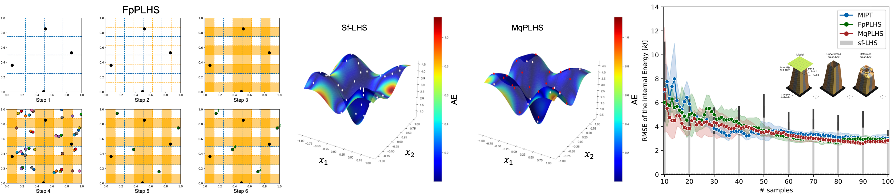

# Python Implementation of Exploration-Oriented Sampling Strategies

The following library provides a Python implementation of the Exploration Sampling Strategies presented in [Lualdi et al. (2022)](https://www.sciencedirect.com/science/article/abs/pii/S1877750322000357). 

<p align="center">

</p>

## Getting Started

To use this library, initialize a DoE class instance and select the desired sampling strategy. Run the sampling function with the desired dimensions (`dd`) and number of samples (`nn`) to generate your Design of Experiment.

### Prerequisites

Python 3.6 or higher with the following dependencies:
- `numpy`
- `chaospy`
- Custom modules: `utils.util_functions`, `utils.objective_functions`, `utils.FpPLHS`, `utils.MqPLHS`

## Examples

Example of a 2D adaptive sampling process using the `MIPT-alpha` strategy. 

```python
# Define the dimension (dd, i.e. number of variables) and size (nn, i.e. max number of samples) of your DOE
dd = 2
nn = 16

# Set-up the adaptive sampling function
gen_doe_MIPT = DOE_class.DOE_Class('MIPT', repeat=random_seed, sizeOneStage=10).DOE

# Generate the DoE and store it
X = gen_doe_MIPT(dd, nn)

# Output:
array([[0.        , 0.22222222],
       [0.11111111, 0.55555556],
       [0.22222222, 0.88888889],
       [0.33333333, 0.11111111],
       [0.44444444, 0.44444444],
       [0.55555556, 0.77777778],
       [0.66666667, 0.        ],
       [0.77777778, 0.33333333],
       [0.88888889, 0.66666667],
       [1.        , 1.        ],
       [0.96932561, 0.04306806],
       [0.74154364, 0.97332512],
       [0.57959185, 0.19490412],
       [0.35492581, 0.6928599 ],
       [0.02270393, 0.80520333],
       [0.68483468, 0.57443643]])
```

## Available Sampling Techniques
### Adaptive sampling 
- `MIPT`: **MIPT-alpha** 
- `FpPLHS`: **Fluttering perfect-Progressive Latin Hypercube Sampling (FpPLHS)**
- `MqPLHS`: **Monte Carlo quasi-Latin Hypercube Sampling (MqPLHS)**
  
### Other Sampling Strategies
- `floor_FF`: **Full-Factorial (FF)**
- `LHS_light`: **Latin Hypercube Sampling (LHS)**
- `sobol`: **Sobol Sequences**
- `halton`: **Halton Sequences**
  
### References

If you use part of the work consider citing:

Pietro Lualdi, Ralf Sturm, Tjark Siefkes: "Exploration-oriented sampling strategies for global surrogate modeling: A comparison between one-stage and adaptive methods", Journal of Computational Science, Volume 60, 2022."
