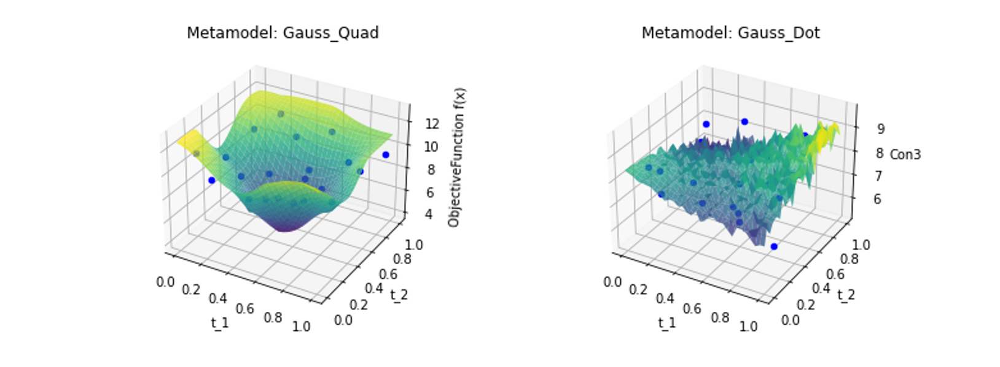
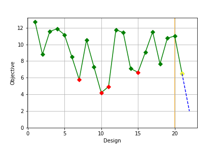
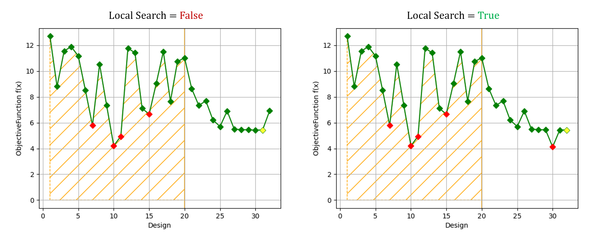

# CS-OPT User Manual

This user manual is intended to provide a concise and friendly guide for users who want to exploit **cs-opt** for black-box optimization applications. 

This user guide is structured in the following sections:
1. **Introduction**
2. **Files preparation**
3. **Set up the optimization problem**
4. **Examples**
5. **Best Practices & Tipps**


## 1. Introduciton

The cs-opt tool can be used for all the black-box applications that are built on a text-based process chain. This implies that input and output values must be provided in readable ASCII files.

As a first step, make sure to follow the **installation instructions** provided in the `README.md` file to set up a proper virtual environment with all python libraries and dependencies needed to run cs-opt. 

The black box solver can be of any type (e.g. FEM, CFD, Electromagnetic Field solvers...) but must be started by a Python script. For simplicity, from here on we will refer to this file as `Master.py`.

The user is asked to fill-in the `Userinterface.py` Python script. This is the relevant script for setting up and controlling the optimization problem. Before getting into the details, it is necessary to properly organize the files needed to run the optimization. This will be explained in the next section.

## 2. Files preparation

Before defining the optimization problem, some preprocessing steps are necessary to prepare all the necessary files.

First of all, it is strongly recommended to create a **working directory** that contains all optimization files (inputs and outputs). The name and path of this working directory is up to the user. From here on we will refer to the working directory as `my_working_dir`.

Inside `my_working_dir` it is mandatory to create a subdirectory to contain all files of the **initial design**. The name of this directory is up to the user. For simplicity, from here on, we will refer to this directory as `InitialDesign`.

Inside `InitialDesign`, the user must contain a complete black-box simulation, that is, a previously computed design, including readable output files.

More specifically, the following files must be included:
- **<ins>Input ASCII file</ins>**: text-based file from which the values of the input variables are read. It can be, for example, a .txt or a .key file
- **<ins>Python main script</ins>**: running this python script, the black-box simulation starts. Typically this file has three main tasks: reading the input values, starting the solver and generating the output file with the final results
- **<ins>Output ASCII file</ins>**: text-based file from which the values of the response functions (i.e. objective and constraint functions) are read
- **<ins>Batch file</ins>** (optional): optionally, a batch file can be provided to run the main script


## 2. Set up the optimization problem

To set up the optimization problem, the user is asked to fill in some dictionary varibles inside the `programming()` function of the `Userinterface.py` file.

<ins>General note</ins>: If you are asked to enter a folder path, please always enter it as a **<ins>Regular Expression (RE)</ins>**. This means that the folder path string should always be preceded by an "r" (e.g. `r'C:/Anaconda3/python.exe'`)

The dictionaries are listed here below:
- `input_param`
- `response_fun`
- `objective_fun`
- `constraint_fun`
- `settings`

The `input_param_dict` looks like the example shown below:


```python
input_param = {
                't_1': {'range': [-4.5, 4.0], 'ref_value': 1.0,
                        'value_type': 'CONTINUOUS', 'jumpsize': 0.001},
                't_2': {'range': [-4.5, 5.0], 'ref_value': 1.0,
                        'value_type': 'C', 'jumpsize': 0.001},
                 }
```

Within the `input_param` dictionary variable, the optimization input parameter has to be defined. Each dictionary key corresponds to an input parameter represented by a subdicitonary.

To add new parameters, an existing parameter's line must be copied and then appropriately modified.

The dictionary keys, i.e. the name of the sub-dictionaries (e.g. `'t_1'` and `'t_2'` in this case), must exactly match the name of the input parameters as they appear in the input ASCII file.

Within each subdictionary, the following keys are to be defined:
- `'range'` (*list of float*): in the case of continuous values, only the lower and the upper limit must be defined, appropriately separated by a comma. In case of discrete values, all the possible values must be defined separated by a comma. 
- `'ref_value'` (*float*): value of the input parameter. This value must match the initial value that can be read in the input file of the `InitialDesign`.
- `'value_type'` (*str*): `'CONTINUOUS'` and '`ORDINALDISCRETE_INDEX`' are the only two acceptable values for continuous and categorical (or discrete-by-index) features respectively. The abbreviations `'C'` and `'O_I'` work the same way. 
- `'jumpsize'` (*float*): this value represents the desired resolution to discretize continuous variables. This resolution value has no effect on categorical features and, thus, can be omitted in that case.

The `response_fun` looks like the example shown below:


```python
response_fun = {
                'ObjectiveFunction f(x)': {'Output_File': 'OptiResponses.out'},
                'Sphere g(x)': {'Output_File': 'OptiResponses.out'}
                 }
```

Within this dictionary variable, the **response functions** and their path folder have to be defined.  Response functions include both the **objective function** and the **constraint functions**.

The first slot of the line, i.e. the name of the sub-dictionary (e.g. `'ObjectiveFunction f(x)'` and `'Sphere g(x)'`), must match the name of the corresponding response function as it appears in the output ASCII file (e.g. `'OptiResponses.out'`).

Within each subdictionary, the following key-values are to be defined:
- `'Output_File'` (*str*): name of the output ASCII file from which the response function has to be read.


The `objective_fun` looks like the example shown below:


```python
objective_fun = {
                 'ObjectiveFunction f(x)': {'goal': 'MIN'}
                 }
```

Within this dictionary variable, the goal of the **objective function** has to be defined.

Specifically, the user is asked to fill in the following box:
- `'goal'` (*str*): `'MIN'` and `'MAX'` are the only two acceptable values in order to either minimize or maximize the objective function respectively.  

The `constraint_fun` looks like the example shown below:


```python
constraint_fun = {
                   'Sphere g(x)': { 'sign': 'LESS', 'value': 9.0,},             
                  }
```

Within this dictionary variable, the **constraint functions** have to be defined. If two or more lines, and thus more than one constraint function is defined, the problem automatically sets itself into a multi-constrained optimization problem.

The first slot of the line, i.e. the name of the sub-dictionary (e.g. `'Sphere g(x)'`), must match the name of the constraint function as it appears in the output file from where it is read (e.g. `'OptiResponses.out'`).

Within each subdictionary, the following key-values are to be defined:
- `'sign'` (*str*): `'LESS'`, `'GREATER'` and `'EQUAL'` are the only acceptable values. Equal constraints are allowed but not recommended. It is preferable to define two inequality constraints with a minimum tolerance than one equality constraint. 
- `'value'` (*float*): threshold to be considered for the given constraint function (e.g. `9.0` in this example)

The `settings` dictionary is used to define the working environment, the desired python environment for the solver and the basic set up of the optimization strategy (e.g. sampling strategy, maximum number of designs, convergence etc).

The `settings` dictionary is composed by the following sub-dictionaries:
- `DOE`
- `Designs`
- `Workspace`

The `DOE` looks like the example shown below:


```python
'DOE': {
        'DOE_type': 'LHS_opti',                       # LHSM, Sobol, Halton, LHS_light, LHS_opti, MIPT, MqPLHS, FpPLHS
        'ExistingDOE': {'loadDOE': False,             # if true an existing DOE is loaded
                        'DOEpickle': 'DOE_saved.p'},  # name of the pickle to be dumped/loaded 
        'BackupSavings': {'pickleBackup': 'backup.p'} # name of the tmp pickle saving the optimization progress
        }
```

Within this dictionary variable, the sampling has to be defined.

- `'DOE_type'` (*str*): str value to define the sampling method. `LHSM`, `Sobol`, `Halton`, `LHS_light`, `LHS_opti`, `MIPT`, `MqPLHS`, `FpPLHS`. LHS_opti is arguably the best method to use as a first choice. If an optimal LHS dataset is not available for a given problem, the `MIPT` method is chosen automatically. Read more about these methods in the docstrings of `DOE_class.py`.
- `'ExistingDOE'` (*dict*): this dictionary can be used to load or save the DOE when completed. In detail:
    - `'loadDOE'` (*bool*): value set to `True` or `False` if a DOE is to be loaded from or saved to a pickle file respectively.
    - `'DOEpickle'` (*str*): name of the pickle file to be loaded/saved. 
- `'BackupSavings'` (*dict*): this sub-dictionary is used to save temporary optimization progress. In detail:
    - `'pickleBackup'` (*str*): name of the pickle used to save progress temporarily (e.g. `'backup.p'`) 

The `Designs` looks like the example shown below:


```python
'Designs': {
                'Dis_Design': {'Name': r'dis_designs/Dis_Design',    # if folder path, please keep the RE as shown here
                               'Starting_Number': 5,
                               'Maximum_Number': 10,
                               'Final_Design': 'Result_Dis',
                               'EndFile': 'Results_dis.txt',
                               'EndPlot': 'Conver_dis.png'},
                'Cont_Design': {'Name': r'cont_designs/Cont_Design', # if folder path, please keep the RE as shown here
                                'Starting_Number': 20,
                                'Maximum_Number': 22,
                                'Final_Design': 'cont_results',
                                'EndFile': 'Results_cont.txt',
                                'EndPlot': 'Conver_cont.png'}
                }
```

The optimization is based on <ins>two consecutive stages</ins>. The first stage deals with the optimization of the **discrete variables**. In the second stage, by keeping the optimized values of the discrete variables constant, the **continuous variables** are optimized. 

In the `Double_Loop branch`, discrete variables are optimized by means of well known software for MINLP (Mixed Integer Non Linear Programming): SCIP. Performances are proven to be better, but the software cannot be used for commercial use.

Here below `Dis_Design` and `Cont_Design` subdictionaries are explained in detail. Keep in mind that if there are no discrete variables defined, the first block is not relevant and can be completely ignored.

`'Dis_Design'`: discrete variables stage:
   - `'Name'`(*str*): name of the directory to collect discrete designs (e.g. `'Dis_Design0001'`, `'Dis_Design0002'`). It is recommended to also define a parent folder (in this case `'dis_designs/'`) to collect all discrete iterations in one folder.
   - `'Starting_Number'`(*int*): size of the DOE
   - `'Maximum_Number'`(*int*): maximum number of discrete designs that must not be exceeded 
   - `'Final_Design'`(*str*): name of the folder containing the optimal design
   - `'EndFile'`(*str*): name of the .txt file that summarizes the discrete optimization results (e.g. `'Results_dis.txt'`)
   - `'EndPlot'`(*str*): name of the image file that shows the discrete optimization convergence curve (e.g. `'Conver_dis.png'`)

`'Cont_Design'`: continuous variables stage:
   - `'Name'`(*str*): name of the directory to collect discrete designs (e.g. `'Cont_Design0001'`, `'Cont_Design0002'`). It is recommended to also define a parent folder (in this case `'cont_designs/'`) to collect all continuous iterations in one folder.
   - `'Starting_Number'`(*int*): size of the DOE
   - `'Maximum_Number'`(*int*): maximum number of continuous designs that must not be exceeded 
   - `'Final_Design'`(*str*): name of the folder containing the optimal design
   - `'EndFile'`(*str*): name of the .txt file that summarizes the continuous optimization results (e.g. `'Results_cont.txt'`)
   - `'EndPlot'`(*str*): name of the image file that shows the continuous optimization convergence curve (e.g. `'Conver_cont.png'`)


The `'Workspace'` looks like the example shown below:


```python
'Workspace': {
                'Python_Executer': r'C:/Anaconda3/python.exe',# solver path (please leave it as RE)
                'Working_dir': r'D:/09-TEST/my_working_dir',  # project folder path
                'Initial_Design': 'Test_InitialDesign',       # initial design folder name
                'Input_File': 'TestMaster.key',               # ASCII file with input ref_values
                'Master_File': 'Ackley_2_Master.py',          # Master file name inside the Initial Design 
                'Bat_File': '',
                'Termination_File': 'OptiResponses.out',      # Termination name for checks inside the termination file
                'Termination_Name': 'Termination check(Error=0; Normal=1)',
               }
```

The `'Workspace'` dictionary should be used to define the optimizaton environment, the desired directory where to save all the optimization files and the black-box solver setup.

The following key-values are to be defined:
- `'Python_Executer'` (*str*): solver path of the python executable of the python venv of the solver (e.g. `r'C:/Anaconda3/python.exe'`)
- `'Working_dir'` (*str*): working directory path where all the optimizization files are going to be saved (e.g. `r'D:/09-TEST/my_working_dir'`)
- `'Initial_Design'` (*str*): initial design folder name (e.g. `'Test_InitialDesign'`)
- `'Input_File'` (*str*): input ASCII file name (e.g. `'TestMaster.key'`)
- `'Master_File'` (*str*): python main script to start the solver (e.g.`'Discrete_Master.py'`)
- `'Bat_File'` (*str*) (optional): optional batch file to run the `'Master_File'`
- `'Termination_File'` (*str*): output ASCII file name (e.g. `'OptiResponses.out'`)
- `'Termination_Name'` (*str*): termination error string (inside the `'Termination_File'`)  to detect possible malfunction errors during simulation

## 3. Display settings

In this section the user can define some **optional visualization settings** regarding metamodels, provisional convergence curve and log-file messages.

More specifically, the following display settings can be defined:
- `show_metamodels` (*bool*): value set to `True` or `False` to show or not the **metamodels** at each iteration step. The metamodels are saved in pdf. format in their respective design folders. If the number of variables is greater than two, this display option is ignored.

- `plot_convergence_checks` (*bool*): value set to `True` or `False` to show or not the prediction of the **convergence curve** iteration by iteration. A .png file is saved at each iteration. This option can be used as a useful diagnostic tool to check the behaviour of the convergence curve without waiting until the end of the optimization
<div align="center">


</div>

- `log_file`(*bool*): value set to `True` or `False` to set if a **log-message** file has to be written or not
- `show_SCIP_Steps`(*bool*): value set to `True` or `False` to get additional information from the SCIP solver if used. In the master branch (SCIP not available), this option is just ignored

## 4. Advanced settings

These settings are **advanced optimization settings** that can only be set by users with a basic backgorund in optimization. Therefore, without prior information about the problem, we recommend to leave these values unchanged.

More specifically, the following advanced settings can be defined:
  - `epsilon` (*float*): floating value (threshold) to define the convergence to terminate the optimization process. This convergence criterion is calculated based on the <ins>last three values</ins>  
  - `parallel_jobs` (*int*): maximal number of parallel executable jobs. This option is currently valid in the DoE stage only 
  - `cv`(*int*): number of k-folds in cross validation to evaluate metamodels
  - `CV_scoring` (*str*): error metric used by cross validation to evalaute the accuracy of metamodels. `'r2'`,`'explained_variance'`,`'neg_mean_squared_error'`,`'neg_median_absolute_error'` and `'max_error'` are the possible values

  - `max_time_SCIP` (*float*): max time in seconds allocated for the SCIP solver for each iteration-step to find the optimum on the metamodels
  - `max_time_Grad` (*float*):  max time in seconds allocated for the Gradient-Based solver for each iteration-step to find the optimum on the metamodels

  - `model_options` (*list of str*): type of GPs metamodel used to model the objective and constraint functions.   `'Gauss_RBF'`,`'Gauss_Dot'`,`'Gauss_Quad'`,`'Gauss_Sum'`,`'Gauss_Matern'` and `'Gauss_MaternQuad'` are the possible options
        
  - `encoding` (*str*): `'Label'`,`'Logarithmic'` and `'One-Hot'` are the possible options about encoding methods. `'Label'`encoding is the simplest option, but has the poorest performances. `'One-Hot'` encoding has the best performances, but it increases the complexity of the problem exponentially. Can be used with few discrete variables (e.g. up to 5). `'Logarithmic'` is a good compromise between the above mentioned methods.  Further information in the cs-opt documentation

  - `fine_Tuning_Loop` (*bool*): if `True` after a full discret optimization loop another one with fixed discrete parameters is executed. If `False` the problem reduces to a single loop only

  - `modify_constraints` (*bool*): if `True` constraint relaxation to find more stable values. The idea is to keep the optimizer away from the unfeasible area. The strictness of constraint functions is increased by an adaptive $`\beta`$ factor. Further information in the cs-opt documentation
  
  - `modification_value` (*float*): intial relaxation value $`\beta`$ to relax constraints

  - `use_Localsearch` (*bool*): if `True` activate the local search refinement option. This Option can be succesfully used to avoid repetitions within iterations next to each other or to avoid picking up point already selected in the DOE:
  <div align="center">

  $`{x_{i}^{mod} = (1-\gamma)\cdot x_{i}+\gamma \cdot x_{opt}^{*}}`$
  </div>

  When this option is active, the convergence curve may look worse than when this option is inactive. However, more information is fed to the regression model and it is more likely that a better optimum can be found 


  - `random_seed` (*int*): uses a random seed for repeatability. If `None` or `False`, the seed is randomly assigned by `time.time()`

## 4. Examples

Examples of possible optimization strategies and their outcome are presented in dedicated jupyter-notebooks. You can find them at `02_johannes_cs-opt\doc\jupyter_notebooks`

## 5. Best Practices & Tipps 

Finally, some practical tips from the author of cs-optislang are listed below:

- It is good practice to always check any possible malfunctionings before starting a complex optimization. To do this check, we strongly encourage you to **run** the two continuous variables optimization based on **the `Ackley_2_Master.py` first**. This optimization problem is already set by default in the `Userinterface.py` script. Please just change the `'Python_Executer'` and the `'Working_dir'` to let cs-opt work


- The **DOE sampling method** set by default (i.e. `LHS_opti`) **is already optimal** and therefore we strongly discourage the user from changing them. Only in case of huge problems (for example more than 25 variables) we suggest to set `MqPLHS` as sampling method


- Convergence is never guaranteed, therefore we encourage the user to set the maximum number of designs carefully.  Keep in mind that the optimization strategy is objective oriented. Thus, we expect to reach the optimum quickly after DOE. The maximum number of designs certainly depends on the complexity of the problem, but on average **20 iterations after DOE** is usually a very good guess.


- The **DOE sampling method** set by default (i.e. `LHS_opti`) **is already optimal** and therefore we strongly discourage the user from changing them. Only in case of huge problems (for example more than 25 variables) we suggest to set `MqPLHS` as sampling method


- Convergence is never guaranteed, therefore we encourage the user to set the maximum number of designs carefully.  Keep in mind that the optimization strategy is objective oriented. Thus, we expect to reach the optimum quickly after DOE. The maximum number of designs certainly depends on the complexity of the problem, but on average **20 iterations after DOE** is usually a very good guess.


- It is advisable to use the **parallel jobs** option to run in parallel jobs that are mutually independent. This option can be particularly advantageous if an external cluster is used to run the simulations


- It is recommended to leave the value of the **cross validation k-folds** equal to **10**. It has a big impact on the evaluation of the metamodels, but guarantees an optimal performance compared to lower values


```python

```
